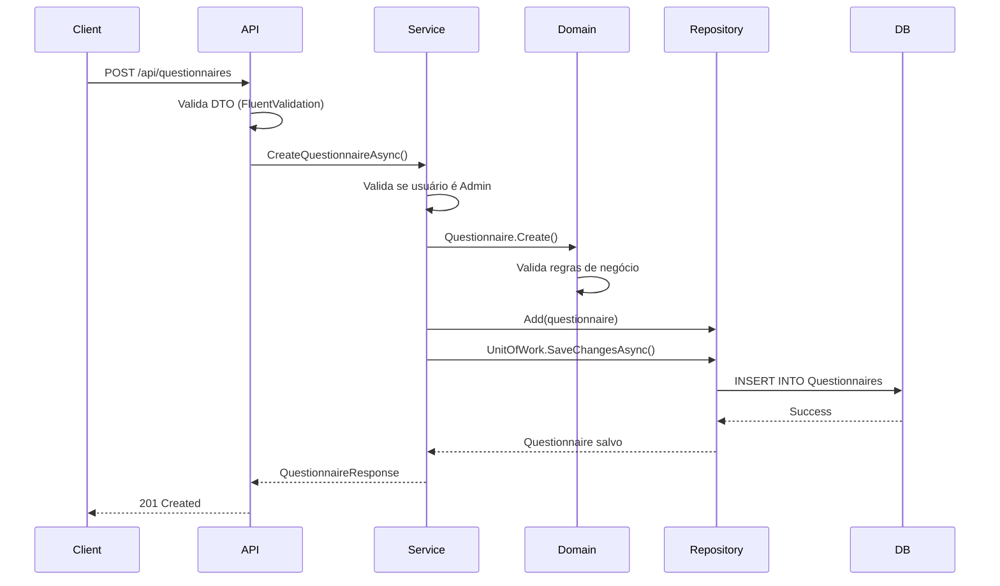
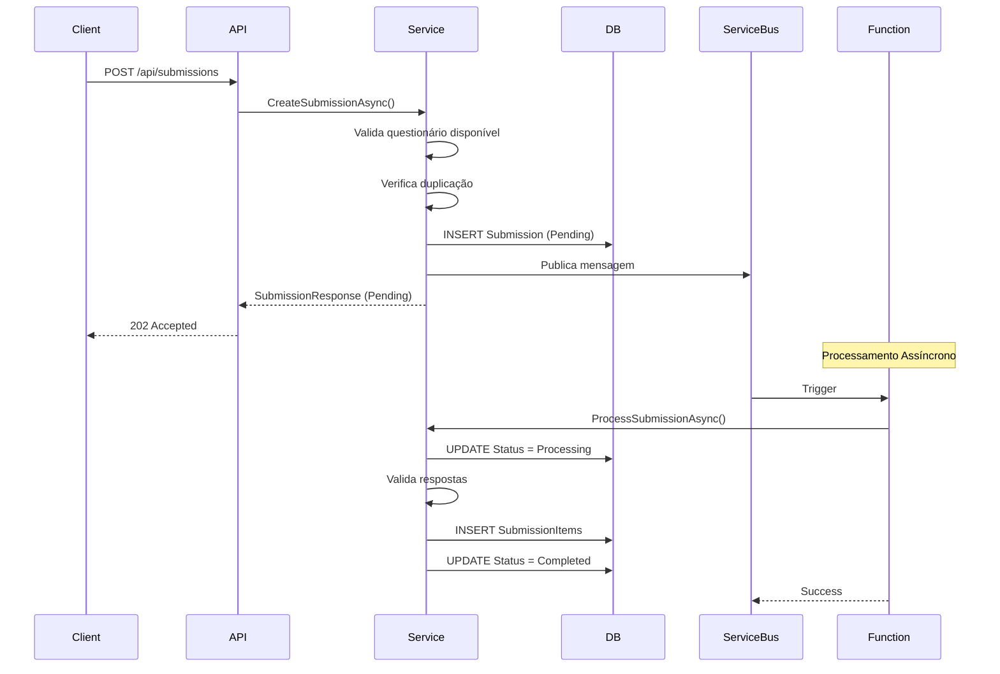

# ?? Survey Questionnaire API

Sistema de gerenciamento de questionários e coleta de respostas desenvolvido com .NET 9, seguindo os princípios de **Domain-Driven Design (DDD)** e **Clean Architecture**.

## ?? Índice

- [Visão Geral](#visão-geral)
- [Arquitetura](#arquitetura)
- [Tecnologias Utilizadas](#tecnologias-utilizadas)
- [Estrutura de Pastas](#estrutura-de-pastas)
- [Padrões e Práticas](#padrões-e-práticas)
- [Fluxo de Processamento](#fluxo-de-processamento)
- [Configuração](#configuração)
- [Como Executar](#como-executar)

---

## ?? Visão Geral

Sistema para criação, publicação e coleta de respostas de questionários, com as seguintes funcionalidades:

### Funcionalidades Principais

- **Gerenciamento de Usuários**: Administradores e usuários públicos
- **Questionários**: Criação, publicação e fechamento de questionários
- **Questões**: Suporte para questões abertas e de múltipla escolha
- **Submissões**: Coleta de respostas com processamento assíncrono
- **Processamento Assíncrono**: Utiliza Azure Service Bus para processamento de respostas

### Regras de Negócio

? Apenas **administradores** podem criar e gerenciar questionários  
? Apenas **usuários públicos** podem responder questionários  
? Um usuário só pode responder **uma vez** cada questionário  
? Questionários só podem ser respondidos durante o **período de coleta**  
? Questões e opções só podem ser editadas enquanto o questionário está em **Draft**

---

## ??? Arquitetura

O projeto segue os princípios de **Clean Architecture** e **Domain-Driven Design (DDD)**, organizados em 5 camadas:

```
???????????????????????????????????????????????????????
?                 Presentation Layer              ?
?     (infnet.SurveyQuestionnaire.Api)         ?
?            (infnet.SurveyQuestionnaire.Functions)   ?
???????????????????????????????????????????????????????
       ?
???????????????????????????????????????????????????????
?              Application Layer       ?
?       (infnet.SurveyQuestionnaire.Application)      ?
?  • Services  • DTOs  • Interfaces  • Validators     ?
???????????????????????????????????????????????????????
        ?
???????????????????????????????????????????????????????
?           Domain Layer        ?
?         (infnet.SurveyQuestionnaire.Domain)         ?
?  • Entities  • Value Objects  • Domain Events       ?
?  • Business Rules  • Repositories Interfaces      ?
???????????????????????????????????????????????????????
         ?
???????????????????????????????????????????????????????
? Infrastructure Layer          ?
?   (infnet.SurveyQuestionnaire.Infrastructure.Data)  ?
?  • EF Core  • Repositories  • Service Bus        ?
?  • Configurations  • Migrations  ?
???????????????????????????????????????????????????????
```

### ?? Camadas

#### 1?? **Domain Layer** (Core)
**O coração do sistema - contém toda a lógica de negócio**

- **Entidades (Aggregates)**
  - `User` - Usuários do sistema (Admin/Public)
  - `Questionnaire` - Questionário (Aggregate Root)
  - `Question` - Questões do questionário
  - `Option` - Opções de múltipla escolha
  - `Submission` - Resposta do questionário (Aggregate Root)
  - `SubmissionItem` - Item individual de resposta

- **Value Objects**
  - `Email` - Validação de e-mail
  - `Entity` - Base class com ID e timestamps

- **Enums**
  - `UserType` - Administrator / Public
  - `QuestionnaireStatus` - Draft / Published / Closed
  - `SubmissionStatus` - Pending / Processing / Completed / Failed

- **Domain Exceptions**
  - Exceções específicas do domínio (validações de negócio)

**Por que esta arquitetura?**
- ? **Independência**: Domain não depende de nenhuma outra camada
- ? **Testabilidade**: Fácil testar regras de negócio isoladamente
- ? **Manutenibilidade**: Lógica de negócio centralizada

#### 2?? **Application Layer**
**Orquestra os casos de uso da aplicação**

- **Services**
  - `UserService` - CRUD de usuários
  - `QuestionnaireService` - Gerenciamento de questionários
  - `SubmissionService` - Criação e processamento de respostas

- **DTOs (Data Transfer Objects)**
  - Request/Response para comunicação API ? Application
  - Separação entre modelos de domínio e API

- **Interfaces**
  - `IServiceBusPublisher` - Abstração para mensageria
  - `IUnitOfWork` - Abstração para transações

**Por que esta camada?**
- ? **Orquestração**: Coordena fluxo entre domain e infrastructure
- ? **Validação**: Valida dados antes de chegar no domain
- ? **Mapeamento**: Converte entre DTOs e entidades de domínio

#### 3?? **Infrastructure Layer**
**Implementa detalhes técnicos (banco de dados, mensageria, etc)**

- **Data Access (EF Core)**
  - `SurveyQuestionnaireDbContext` - DbContext principal
  - Repositories - Implementação de acesso a dados
  - Configurations - Fluent API do EF Core
  - Migrations - Versionamento do banco

- **Service Bus**
  - `AzureServiceBusPublisher` - Publicação de mensagens

- **Unit of Work**
  - Implementação de transações

**Por que EF Core?**
- ? **ORM maduro**: Mapeamento objeto-relacional robusto
- ? **Migrations**: Controle de versão do banco de dados
- ? **LINQ**: Queries fortemente tipadas
- ? **Change Tracking**: Detecção automática de mudanças

#### 4?? **API Layer** (Presentation)
**Interface REST para consumo externo**

- **Controllers**
  - `UsersController` - Endpoints de usuários
  - `QuestionnairesController` - Endpoints de questionários
  - `SubmissionsController` - Endpoints de submissões

- **Middleware**
  - `ExceptionHandlingMiddleware` - Tratamento global de erros

- **Validators**
  - FluentValidation para validação de DTOs

- **AutoMapper**
  - Mapeamento entre DTOs da API e Application

**Por que esta separação?**
- ? **Isolamento**: API não conhece detalhes de domínio
- ? **Versionamento**: Fácil criar múltiplas versões da API
- ? **Swagger**: Documentação automática

#### 5?? **Functions Layer** (Background Processing)
**Azure Functions para processamento assíncrono**

- **SubmissionProcessor**
  - Processa mensagens do Service Bus
  - Adiciona `SubmissionItems` à submissão
  - Marca status como `Completed` ou `Failed`

**Por que Azure Functions?**
- ? **Escalabilidade**: Escala automaticamente sob demanda
- ? **Serverless**: Paga apenas pelo uso
- ? **Desacoplamento**: API não trava esperando processamento

---

## ??? Tecnologias Utilizadas

### Core Framework
| Tecnologia | Versão | Uso |
|-----------|--------|-----|
| **.NET** | 9.0 | Framework principal |
| **C#** | 13.0 | Linguagem de programação |

### Persistência
| Tecnologia | Uso | Por quê? |
|-----------|-----|---------|
| **Entity Framework Core** | ORM | Mapeamento objeto-relacional robusto |
| **SQL Server** | Banco de dados | Confiabilidade e suporte a transações |
| **EF Core Migrations** | Versionamento do schema | Controle de versão do banco |

### Mensageria
| Tecnologia | Uso | Por quê? |
|-----------|-----|---------|
| **Azure Service Bus** | Fila de mensagens | Processamento assíncrono confiável |

### API & Documentation
| Tecnologia | Uso | Por quê? |
|-----------|-----|---------|
| **ASP.NET Core Web API** | Framework REST | Padrão da indústria |
| **Swagger/OpenAPI** | Documentação | Documentação interativa automática |
| **AutoMapper** | Mapeamento de objetos | Reduz código boilerplate |

### Validação
| Tecnologia | Uso | Por quê? |
|-----------|-----|---------|
| **FluentValidation** | Validação de DTOs | Validações declarativas e legíveis |

### Background Processing
| Tecnologia | Uso | Por quê? |
|-----------|-----|---------|
| **Azure Functions** | Processamento assíncrono | Serverless, escalável e econômico |

---

## ?? Estrutura de Pastas

```
infnet.SurveyQuestionnaire/
?
??? ?? infnet.SurveyQuestionnaire.Api/              # Camada de Apresentação (REST API)
?   ??? Controllers/           # Endpoints REST
?   ??? DTOs/   # Data Transfer Objects (API)
?   ??? Middleware/     # Exception handling
?   ??? Validators/    # FluentValidation
?   ??? Mappings/      # AutoMapper profiles
?   ??? Configuration/    # DI e configurações
?   ??? Program.cs        # Entry point
?
??? ?? infnet.SurveyQuestionnaire.Application/      # Camada de Aplicação
???? Services/        # Application Services
?   ?   ??? UserService.cs
?   ?   ??? QuestionnaireService.cs
?   ?   ??? SubmissionService.cs
?   ??? DTOs/    # Data Transfer Objects (App)
?   ?   ??? Users/
?   ?   ??? Questionnaires/
? ?   ??? Submissions/
?   ??? Interfaces/            # Abstrações
?   ?   ??? IServiceBusPublisher.cs
?   ?   ??? IService interfaces
?   ??? Validators/              # Business validations
?
??? ?? infnet.SurveyQuestionnaire.Domain/     # Camada de Domínio (Core)
?   ??? Entities/    # Entidades de domínio
?   ?   ??? User.cs            # Aggregate Root
?   ?   ??? Questionnaire.cs          # Aggregate Root
?   ?   ??? Question.cs
?   ?   ??? Option.cs
?   ?   ??? Submission.cs            # Aggregate Root
?   ?   ??? SubmissionItem.cs
?   ??? Common/           # Base classes
?   ?   ??? Entity.cs
?   ?   ??? ValueObject.cs
?   ?   ??? IUnitOfWork.cs
?   ??? Users/    # Value Objects
?   ?   ??? Email.cs
?   ?   ??? UserType.cs
?   ??? Enums/
?   ?   ??? QuestionnaireStatus.cs
?   ?   ??? SubmissionStatus.cs
?   ??? Exceptions/      # Domain Exceptions
?   ?   ??? UserDomainException.cs
?   ?   ??? QuestionnaireDomainException.cs
?   ?   ??? SubmissionDomainException.cs
?   ??? Repositories/      # Repository Interfaces
?       ??? IUserRepository.cs
?       ??? IQuestionnaireRepository.cs
?       ??? ISubmissionRepository.cs
?
??? ?? infnet.SurveyQuestionnaire.Infrastructure.Data/  # Camada de Infraestrutura
?   ??? Context/
?   ?   ??? SurveyQuestionnaireDbContext.cs        # EF Core DbContext
?   ??? Configurations/       # EF Core Fluent API
?   ?   ??? UserConfiguration.cs
? ?   ??? QuestionnaireConfiguration.cs
?   ?   ??? QuestionConfiguration.cs
?   ?   ??? OptionConfiguration.cs
?   ?   ??? SubmissionConfiguration.cs
?   ?   ??? SubmissionItemConfiguration.cs
?   ??? Repositories/           # Repository Implementations
? ?   ??? UserRepository.cs
?   ?   ??? QuestionnaireRepository.cs
?   ?   ??? SubmissionRepository.cs
?   ??? ServiceBus/
? ?   ??? AzureServiceBusPublisher.cs          # Service Bus Publisher
?   ??? Migrations/           # EF Core Migrations
?   ??? UnitOfWork.cs    # Unit of Work Implementation
?
??? ?? infnet.SurveyQuestionnaire.Functions/        # Azure Functions
    ??? SubmissionProcessor.cs     # Processa submissions

```

---

## ?? Padrões e Práticas

### ??? Domain-Driven Design (DDD)

#### **Aggregates**
Agrupamento de entidades relacionadas com um root único:

```csharp
// ? Questionnaire é o Aggregate Root
public sealed class Questionnaire : Entity
{
    private readonly List<Question> _questions = []; // Entidades filhas
    public IReadOnlyCollection<Question> Questions => _questions.AsReadOnly();
    
    // Métodos de domínio controlam acesso às entidades filhas
    public Guid AddQuestion(string text, bool isRequired, bool isMultipleChoice) { }
    public void RemoveQuestion(Guid questionId) { }
}
```

**Por quê?**
- ? **Consistência**: Garante que regras de negócio sejam sempre aplicadas
- ? **Encapsulamento**: Entidades filhas só são acessadas via aggregate root
- ? **Transações**: Um aggregate = uma transação

#### **Value Objects**
Objetos sem identidade, definidos por seus valores:

```csharp
public sealed class Email : ValueObject
{
    public string Value { get; }
    
    private Email(string value) 
    {
        // Validação no construtor
        if (!IsValid(value))
         throw new ArgumentException("Invalid email");
        Value = value;
    }
}
```

**Por quê?**
- ? **Imutabilidade**: Não pode ser alterado após criação
- ? **Validação**: Sempre válido (validação no construtor)
- ? **Igualdade por valor**: Dois emails com mesmo valor são iguais

#### **Repository Pattern**
Abstração de acesso a dados:

```csharp
// Domain define a interface
public interface IQuestionnaireRepository
{
    Task<Questionnaire?> GetByIdAsync(Guid id);
    void Add(Questionnaire questionnaire);
  void Update(Questionnaire questionnaire);
}

// Infrastructure implementa
public class QuestionnaireRepository : IQuestionnaireRepository
{
    private readonly SurveyQuestionnaireDbContext _context;
    // Implementação usando EF Core
}
```

**Por quê?**
- ? **Abstração**: Domain não conhece detalhes de persistência
- ? **Testabilidade**: Fácil mockar em testes
- ? **Flexibilidade**: Trocar implementação sem afetar domain

### ?? Unit of Work Pattern

Gerencia transações em um único ponto:

```csharp
public interface IUnitOfWork
{
    Task<int> SaveChangesAsync(CancellationToken cancellationToken = default);
}
```

**Por quê?**
- ? **Transações atômicas**: Múltiplas operações em uma transação
- ? **Consistência**: Garante que todas as mudanças sejam salvas juntas
- ? **Performance**: Batch updates

### ?? CQRS Simplificado

Separação lógica entre Commands e Queries:

```csharp
// Command (modifica estado)
public async Task<QuestionnaireResponse> CreateQuestionnaireAsync(CreateQuestionnaireRequest request)

// Query (lê dados)
public async Task<QuestionnaireResponse> GetQuestionnaireByIdAsync(Guid id)
```

### ?? Processamento Assíncrono

**Fluxo:**
```
1. API recebe POST /submissions
2. Valida dados e cria Submission (status: Pending)
3. Publica mensagem no Service Bus
4. Retorna 202 Accepted
5. Azure Function processa mensagem
6. Adiciona SubmissionItems
7. Atualiza status para Completed/Failed
```

**Por quê?**
- ? **Responsividade**: API não trava esperando processamento
- ? **Escalabilidade**: Function escala independentemente
- ? **Resiliência**: Retry automático em caso de falha

### ??? Defensive Programming

**Validações em camadas:**

```csharp
// 1?? API Layer: FluentValidation (validações de formato)
public class CreateQuestionnaireRequestDtoValidator : AbstractValidator<CreateQuestionnaireRequestDto>

// 2?? Application Layer: Validações de caso de uso
if (!user.IsAdministrator())
    throw new UnauthorizedAccessException();

// 3?? Domain Layer: Validações de negócio
if (Status != QuestionnaireStatus.Draft)
    throw new QuestionnaireCannotModifyPublishedException(Id);
```

### ?? Dependency Injection

**Inversão de controle total:**

```csharp
// Registro no Program.cs
builder.Services.AddScoped<IQuestionnaireRepository, QuestionnaireRepository>();
builder.Services.AddScoped<IQuestionnaireService, QuestionnaireService>();
```

**Por quê?**
- ? **Loose Coupling**: Classes não conhecem implementações concretas
- ? **Testabilidade**: Fácil injetar mocks
- ? **Lifetime Management**: Container gerencia ciclo de vida

---

## ?? Fluxo de Processamento

### ?? Criar Questionário



### ? Submeter Respostas (Processamento Assíncrono)



---

## ?? Configuração

### ?? Pré-requisitos

- **.NET 9 SDK**
- **SQL Server** (LocalDB ou instância completa)
- **Azure Service Bus** (para processamento assíncrono)
- **Visual Studio 2022** ou **VS Code**

### ?? Configuração do appsettings.json

```json
{
  "ConnectionStrings": {
    "DefaultConnection": "Server=(localdb)\\mssqllocaldb;Database=SurveyQuestionnaireDb;Trusted_Connection=True;MultipleActiveResultSets=true"
  },
  "AzureServiceBus": {
 "ConnectionString": "Endpoint=sb://your-namespace.servicebus.windows.net/;SharedAccessKeyName=RootManageSharedAccessKey;SharedAccessKey=your-key",
    "DefaultQueueName": "submission-queue"
  },
  "Logging": {
    "LogLevel": {
"Default": "Information",
   "Microsoft.AspNetCore": "Warning",
      "Microsoft.EntityFrameworkCore.Database.Command": "None",
      "Microsoft.EntityFrameworkCore.Infrastructure": "None",
   "Microsoft.EntityFrameworkCore.Query": "None"
}
  }
}
```

### ??? Configuração do Banco de Dados

```bash
# Aplicar migrations
cd infnet.SurveyQuestionnaire.Infrastructure.Data
dotnet ef database update --startup-project ../infnet.SurveyQuestionnaire.Api

# Criar nova migration (se necessário)
dotnet ef migrations add MigrationName --startup-project ../infnet.SurveyQuestionnaire.Api
```

---

## ?? Como Executar

### 1?? **Clonar o repositório**

```bash
git clone https://github.com/LeandroDrumond/infnet.SurveyQuestionnaire.git
cd infnet.SurveyQuestionnaire
```

### 2?? **Restaurar dependências**

```bash
dotnet restore
```

### 3?? **Aplicar Migrations**

```bash
cd infnet.SurveyQuestionnaire.Infrastructure.Data
dotnet ef database update --startup-project ../infnet.SurveyQuestionnaire.Api
```

### 4?? **Configurar Azure Service Bus**

1. Criar um namespace no Azure Service Bus
2. Criar uma fila chamada `submission-queue`
3. Copiar a connection string
4. Atualizar `appsettings.json`

### 5?? **Executar a API**

```bash
cd infnet.SurveyQuestionnaire.Api
dotnet run
```

**Swagger UI:** https://localhost:5001/swagger

### 6?? **Executar Azure Function (Opcional)**

```bash
cd infnet.SurveyQuestionnaire.Functions
func start
```

---

## ?? Endpoints Principais

### ?? Usuários

| Método | Endpoint | Descrição |
|--------|----------|-----------|
| `POST` | `/api/users` | Criar usuário |
| `GET` | `/api/users` | Listar usuários |
| `GET` | `/api/users/{id}` | Buscar usuário por ID |
| `PUT` | `/api/users/{id}` | Atualizar usuário |
| `PATCH` | `/api/users/{id}/deactivate` | Desativar usuário |

### ?? Questionários

| Método | Endpoint | Descrição |
|--------|----------|-----------|
| `POST` | `/api/questionnaires` | Criar questionário (Admin) |
| `GET` | `/api/questionnaires` | Listar questionários |
| `GET` | `/api/questionnaires/{id}` | Buscar questionário |
| `PUT` | `/api/questionnaires/{id}` | Atualizar questionário |
| `POST` | `/api/questionnaires/{id}/publish` | Publicar questionário |
| `POST` | `/api/questionnaires/{id}/questions` | Adicionar questão |

### ? Submissões

| Método | Endpoint | Descrição |
|--------|----------|-----------|
| `POST` | `/api/submissions` | Submeter respostas (Public) |
| `GET` | `/api/submissions/{id}` | Buscar submissão |
| `GET` | `/api/submissions/questionnaire/{id}` | Listar submissões (Admin) |

---

## ?? Testes

### Estrutura de Testes (TODO)

```
tests/
??? Domain.Tests/    # Testes unitários de domínio
??? Application.Tests/     # Testes de serviços
??? Api.Tests/            # Testes de integração
```

---

## ?? Decisões Arquiteturais

### ? Por que Clean Architecture?

1. **Independência de frameworks**: Domain não depende de EF Core, ASP.NET, etc
2. **Testabilidade**: Fácil testar lógica de negócio sem infraestrutura
3. **Manutenibilidade**: Mudanças em infrastructure não afetam domain
4. **Flexibilidade**: Trocar banco de dados sem afetar regras de negócio

### ? Por que DDD?

1. **Complexidade de negócio**: Muitas regras (permissões, status, validações)
2. **Aggregates**: Garantem consistência (Questionnaire com Questions)
3. **Ubiquitous Language**: Código reflete linguagem de negócio
4. **Bounded Contexts**: Separação clara de responsabilidades

### ? Por que Processamento Assíncrono?

1. **Responsividade**: API retorna imediatamente (202 Accepted)
2. **Escalabilidade**: Azure Function escala independentemente
3. **Resiliência**: Retry automático em caso de falha
4. **Custo**: Paga apenas pelo processamento (serverless)

### ? Por que EF Core?

1. **Produtividade**: Menos código boilerplate
2. **Migrations**: Versionamento do banco
3. **LINQ**: Queries fortemente tipadas
4. **Ecossistema**: Integração com .NET

### ? Por que Repository Pattern?

1. **Abstração**: Domain não conhece EF Core
2. **Testabilidade**: Fácil mockar em testes
3. **Centralização**: Queries complexas em um lugar
4. **Flexibilidade**: Trocar implementação sem afetar domain

---

## ?? Contribuindo

1. Fork o projeto
2. Crie uma branch (`git checkout -b feature/nova-funcionalidade`)
3. Commit suas mudanças (`git commit -m 'Adiciona nova funcionalidade'`)
4. Push para a branch (`git push origin feature/nova-funcionalidade`)
5. Abra um Pull Request

---

## ?? Licença

Este projeto está sob a licença MIT.

---

## ????? Autores

- **Leandro Drumond** - [GitHub](https://github.com/LeandroDrumond)

---

## ?? Referências

- [Clean Architecture - Robert C. Martin](https://blog.cleancoder.com/uncle-bob/2012/08/13/the-clean-architecture.html)
- [Domain-Driven Design - Eric Evans](https://www.domainlanguage.com/ddd/)
- [Microsoft Docs - EF Core](https://docs.microsoft.com/ef/core/)
- [Azure Service Bus](https://docs.microsoft.com/azure/service-bus-messaging/)
- [ASP.NET Core](https://docs.microsoft.com/aspnet/core/)

---

? **Se este projeto te ajudou, considere dar uma estrela!**
